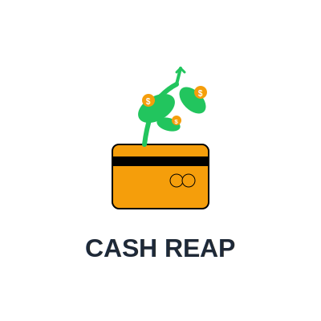

# CashReap



**CashReap** is a modern, local-first business search and rewards platform designed to help users maximize their credit card rewards with intelligent recommendations and premium branding.

---

## 🚀 Features
- **Intelligent Business Search:** Fuzzy matching, instant results, and live suggestions for every local business.
- **Card Recommendations:** Instantly see the best card for every store, with rotating category logic and reward rate sorting.
- **Modern Authentication:** Secure signup/signin with local-first privacy.
- **Premium Branding:** Beautiful, bold UI with a transparent logo for a professional look.
- **Deduplication:** Smart normalization of business names and locations.
- **Comprehensive Coverage:** Expansive business dictionary and competitive advantages.
- **Local-First:** SQLite backend for fast, private, and reliable data.

---

## 🛠️ Tech Stack
- **Frontend:** React, Vite, Tailwind CSS, Wouter
- **Backend:** Node.js, Express, Drizzle ORM, SQLite
- **Search:** Fuse.js for fuzzy matching
- **Authentication:** Local-first, modern auth

---

## 📦 Getting Started
1. **Clone the repo:**
	```bash
	git clone https://github.com/JawwadKiani/cash-reap.git
	cd cash-reap
	```
2. **Install dependencies:**
	```bash
	npm install
	```
3. **Run the backend:**
	```bash
	npm run dev
	```
4. **Run the frontend:**
	```bash
	cd client
	npm install
	npm run dev
	```
5. **Open in browser:**
	- Backend API: [http://localhost:5000](http://localhost:5000)
	- Frontend: [http://localhost:3000](http://localhost:3000)

---

## 🖼️ Branding
CashReap uses a bold, transparent logo for a premium look across all pages. The UI is designed for clarity, trust, and instant recognition.

---

## 📚 Documentation & Support
- For setup help, see `.env.example` for environment variables.
- Edit frontend in `client/src`, backend in `server/`.
- For issues or feature requests, open a GitHub issue.

---

## 📝 License
MIT License. See `LICENSE` for details.
